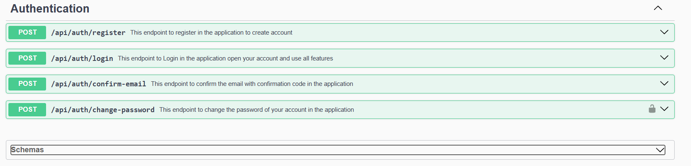

# 🛒 eCommerce Application

A full-featured eCommerce application built using **Spring Boot**, **Spring Data JPA**, **Spring Security**, **JavaMail (Gmail SMTP)**, and **Logger** for tracking email errors.

## ✨ Features

- **User Authentication & Authorization** (JWT-based security)
- **Product Management** (CRUD operations)
- **Shopping Cart** (Add, remove, and update items)
- **Order Processing** (Checkout, payment, order tracking)
- **Email Notifications** (JavaMail for order confirmations)
- **Logging & Error Tracking** (Logs email failures and system errors)
- **User Reviews & Comments** (Users can review and comment on products)
  
## 📸 Screenshots
### **Swagger Documentation **
## 📌 API Endpoints



### **Database Schema**


## 🚀 Installation

1. **Clone the repository**
   ```bash
   git clone https://github.com/yourusername/ecommerce.git
   cd ecommerce
   ```

2. **Configure the application**
   - Set up your database (MySQL, PostgreSQL, or H2)
   - Configure `application.properties` with your database and email credentials.

3. **Run the application**
   ```bash
   mvn spring-boot:run
   ```

4. **Access the API**
   ```
   http://localhost:8080/api
   ```
   
## 🛠 Technologies Used

- **Spring Boot** – Backend framework
- **Spring Security** – Authentication & Authorization
- **Spring Data JPA** – ORM & database management
- **JavaMail** – Email notifications
- **Logger** – Logging and error tracking
  
🚀 Developed by **Mohamed Amgad**
